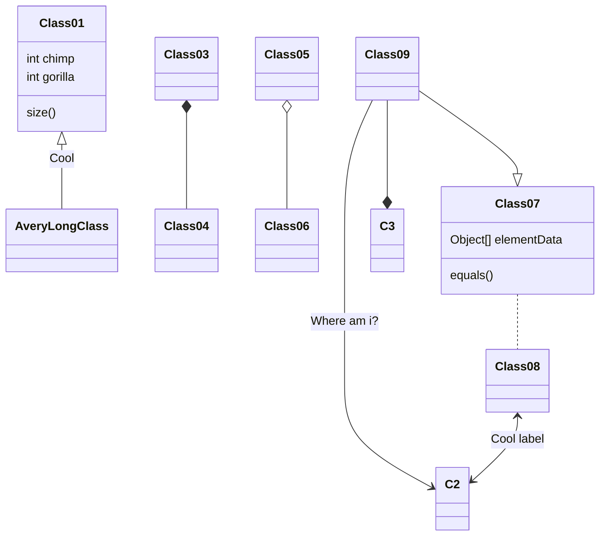

# Ordenação e Recuperação - 25/06/19

## Grafos
- Conceitos básicos
- Vértices: entidades
- Arestas: relações entre vértices
- Tamanho: n(vértices) + n(arestas)
- Dois vértices são adjacentes quando tocados pela mesma aresta
- Quando duas extremidades de uma aresta tocam o mesmo vértice, diz-se loop
- O complementar de um grafo G, é um outro grafo G2, onde todos as ligações são invertidas

### Representação
- Lista de Adjacências
- Matriz de Adjacências

### Algoritmos de Busca em Grafos
- Busca em Extensão/Largura
- Busca em Profundidade

### Exercício
1. Implementar algoritmos de busca em grafos
- Implementar matriz e lista de adjacências
- Implementar leitor de grafos em arquivos
- Implementar Busca em Largura
- Implementar Busca em Profundidade

