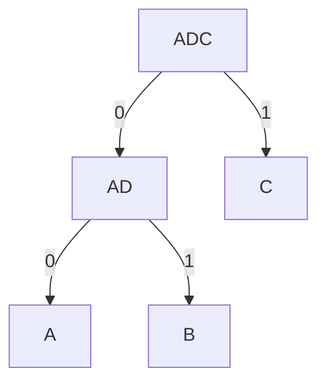

# Algoritmo de Huffman

## Código

Seriam necessárias as seguintes estruturas:

~~~c
struct code_type{
	int bits[50];
	int size;
}

struct node_t {
	node_t 	*pai;
	node_t 	*esquerdo;
	node_t 	*direito;
    int		freq;
}
~~~

### FOLHASFolhas

- Folhas que não tiverem frequência não vão entrar
- Quem vai dizer em que momento quem será ignorado (da Heap) é a frequência

### Fila de Prioridade Mínima

- A fila de prioridade mínima deve ter, além das frequências, os símbolos.
- Não é preciso saber onde os elementos estão na fila de prioridade. Apenas a frequência e o símbolo.

~~~c
node_t	nodes[2*256 - 1];
for(i = 0; i < 256; ++i)
	Q.insert(i);
~~~

O que já temos:

- 256 folhas
- Fila preenchida com as folhas

### Construindo a Árvore de Codificação

Laço de construção:

~~~C
cont = 256;
while(Q.right > 1) {
	s1 = Q.extractMin();
	s2 = Q.extractMin();
	f1 = folhas[s1, i];
	f2 = folhas[s2, i];
    
    f = make_node();
    f.setLeft(f1);
 	f.setRight(f2);
    
    f.freq = f1.freq + f2.freq;
    nodes[cont] = f;
    Q.insertKey(cont);
    ++cont;
}
~~~

- Os sets ao final são os mesmos sets de uma inserção em árvore binária. Ele apenas atualiza os ponteiros pros novos filhos/pais.

O que temos até agora:

Uma estrutura como uma árvore binária.

- Só se coloca na fila de prioridade mínima quem tem frequência maior que 0;

Testes necessários na árvore:

- Sou filho a esquerda?  Se sim, incorporo o 0 ao meu código e subo para o pai;
- Sou filho a direita? Se sim, incorporo o 1 ao código e subo para o pai;