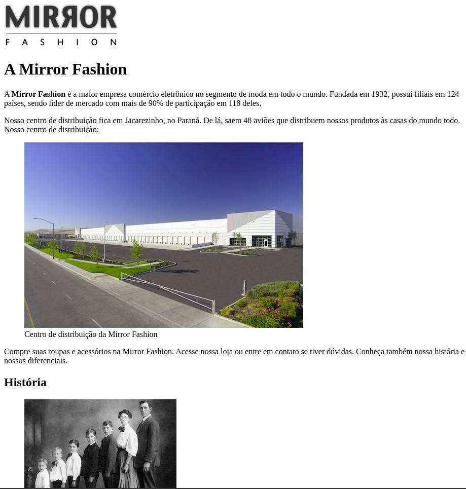
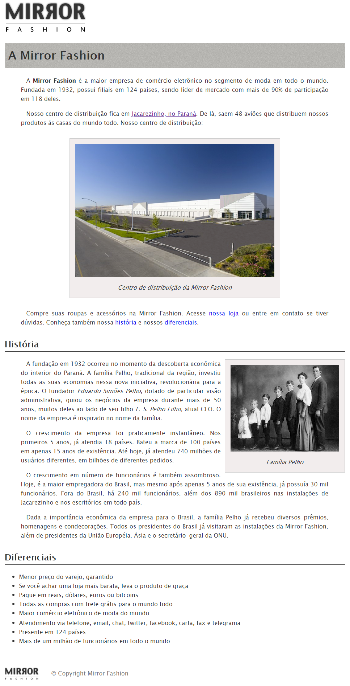

# Tópicos Especiais em Web Development

Disciplina dada por Prof. Raoni.

## 1a Atividade: Questionário

## 2a Atividade: Página HTML/CSS

Transformar o HTML que segue

No mais próximo possível à imagem abaixo:

Resultado:

